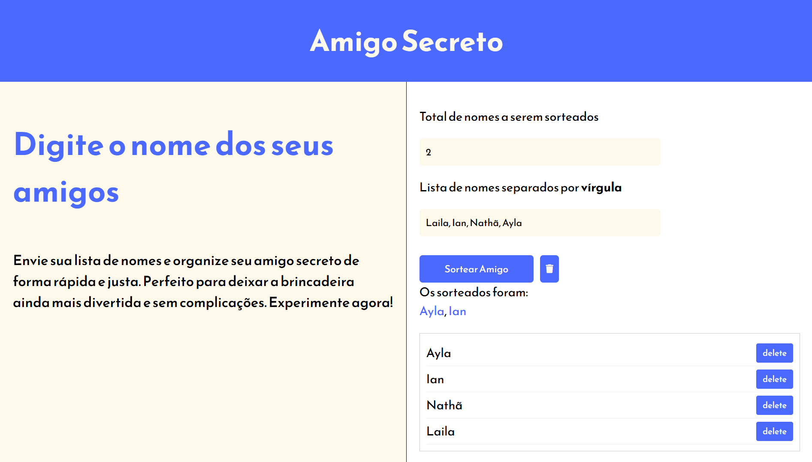

# 🎁 Challenge Amigo Secreto

_**⬇️ Clique abaixo para acessar a página do projeto.**_

 

---

## 📌 Sumário
- [📖 Sobre o Projeto](#sobre-o-projeto)
- [🚀 Funcionalidades](#funcionalidades)
- [🛠 Tecnologias Utilizadas](#tecnologias)
- [👩‍💻 Desenvolvedora](#desenvolvedora)

---

## 📖 Sobre o Projeto 

O **Challenge Amigo Secreto** foi desenvolvido como parte do desafio da formação **Iniciante em Programação** do **Programa Oracle Next Education**, uma iniciativa da Oracle em parceria com a Alura. O projeto simula um sorteio de Amigo Secreto, permitindo que os usuários adicionem nomes, visualizem a lista e realizem o sorteio de maneira interativa.

---

## 🚀 Funcionalidades 

✅ **Adicionar nomes**: Usuários podem inserir um nome e adicioná-lo à lista visível ao clicar em "Adicionar".  
✅ **Validação de entrada**: Um alerta é exibido caso o campo esteja vazio.  
✅ **Visualização da lista**: Os nomes inseridos aparecem abaixo do campo de entrada.  
✅ **Sorteio aleatório**: Um nome é sorteado aleatoriamente ao clicar no botão "Sortear Amigo".  

### 🔹 Melhorias Implementadas

- **🚫 Remoção de Nomes Duplicados**: O código identifica e alerta sobre nomes repetidos antes do sorteio.  
- **🗑 Exibição da Lista com Botão de Exclusão**: Cada nome inserido tem um botão "Delete" para removê-lo individualmente.  
- **🎉 Animação de Confetes**: Efeito visual de comemoração utilizando a biblioteca `canvas-confetti`.  
- **⚠️ Mensagens de Validação Detalhadas**: Impede sorteios inválidos (zero, negativos ou maior que a lista).  
- **🧹 Função "Limpar Lista"**: Um botão que reseta os campos de entrada e a lista de nomes.  
- **⏎ Execução com "Enter"**: Pressionar "Enter" adiciona automaticamente um novo nome.  

---

## 🛠 Tecnologias Utilizadas 

  
  
  

---

## 👩‍💻 Desenvolvedora 

<a href="https://github.com/L-Boidheach">
  

**[L-Boidheach](https://github.com/L-Boidheach)**  
🔗 *Confira mais projetos no GitHub!*

