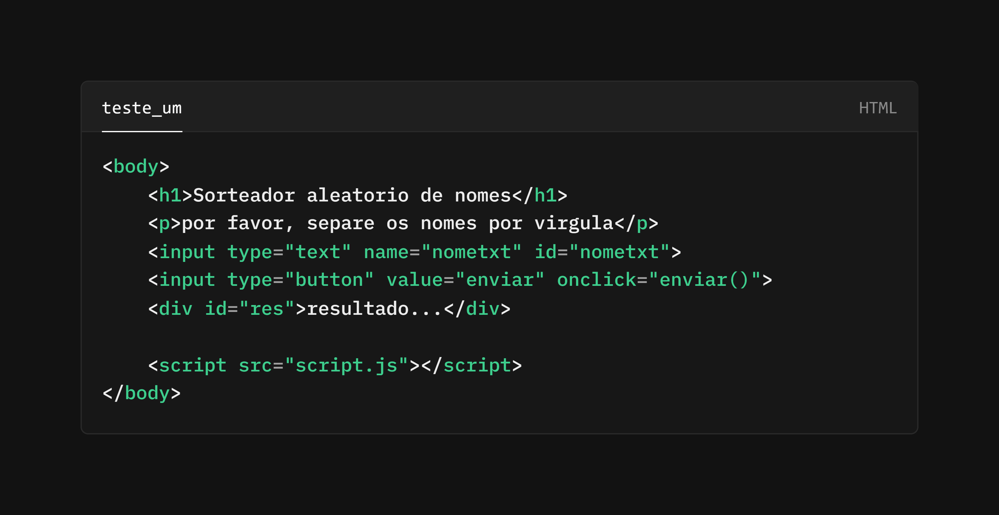

## Passo a passo da elaboração do projeto

Antes de começar a realmente criar o programa de sorteio, desci realizar algumas pesquisas na internet em sites que ofereciam serviços semelhantes ao que eu pretendia criar. Notei que a maioria deles solicita que os nomes sejam separados por vírgulas, o que, de fato, torna o processo muito mais fácil do que enviar um por um para, em seguida, realizar o sorteio. Com um simples HTML, sem CSS, comecei a testar uma lógica em que isso funcionaria de maneira eficiente.

.png)

Entretanto, parar na primeira melhoria nunca é a melhor opção. Percebi que tais websites também permitem que o usuário escolha quantos nomes deseja sortear, e eu queria implementar essa funcionalidade. Até agora (pois escrevo conforme meus avanços), essa foi a parte mais difícil. Isso ocorreu porque decidi dissecar outros códigos JavaScript com o mesmo objetivo, ou ao menos semelhantes ao meu, analisando linha por linha com o auxílio de I.A. A solução mais satisfatória que consegui encontrar foi o seguinte código.

.png)

Infelizmente, sinto que esta versão pode acabar entrando em um loop infinito. Vou tentar realizar melhorias nela.

___

Depois de três xícaras de café, recorri ao auxílio de I.A. para me fornecer a solução do erro (realmente estava entrando em um loop infinito). O resultado foi que o erro real em meu código poderia ser resolvido simplesmente adicionando um 'return'. 

.png)
